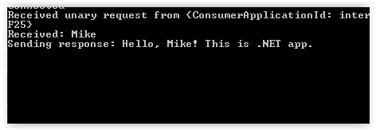

# Plexus Interop [](https://finosfoundation.atlassian.net/wiki/display/FINOS/Incubating) [](https://ci.appveyor.com/project/finos/plexus-interop/branch/master) [](https://www.myget.org/)

## Overview

The **Plexus Interop** project aims to define an open standard for desktop application interoperability and provides
reference implementation of this standard. It formalizes connections between applications within a single user session
on client desktop through a central broker.

The main goal is to enable development of extensible workflows connecting independent apps developed by different
organizations in different technologies (.NET, Web, Java, Python, etc.) by passing relevant context  (structured
data objects) between those apps.

Although the industry is moving towards containerized desktop applications, Plexus Interop recognizes that much
of the application landscape is not yet tied to containers and is architecturally agnostic of container implementation.
Separating interoperability from the container provides notable advantages: different containers can be leveraged in
the same workflow, and launched applications residing outside of containers can participate in interop activities.

Technically speaking, Plexus Interop is a metadata-centric language-agnostic desktop app-to-app interoperability
framework with an extensible model for launching new instances of desktop applications on demand. Its extensibility
is based on open standards which are essential parts of the project.  The architecture is based around central broker
providing hub-and-spoke connectivity between apps and brokering strongly-typed RPC-style calls between them. The broker
has a connection to an Application Lifecycle Manager (or Launcher) which is capable of creating new instances of apps
based on the their runtime-metadata (e.g. container type, launch command, command line parameters) defined in a registry.


## Raising an Issue
* Please raise issues to the project mailing list <plx@finos.org> ([Web Archive](https://groups.google.com/a/finos.org/forum/#!forum/plx)). Some people from project teams currently can't access build-in github issue tracker from corporate network.
* Please also tag the new issue with either "Bug" or "Enhancement".
 
## Repository Overview

Plexus Interop repository consist of the following main sections:
* *desktop* - Interop Broker, .NET Interop Client and sample apps implemented in C# using [.NET Core 2.0](https://www.microsoft.com/net/download/core).
* *web* - Web Interop Client and sample apps implemented in [TypeScript](https://www.typescriptlang.org/).
* *dsl* - [Protobuf](https://developers.google.com/protocol-buffers/) and Plexus Interop grammar parsers, validators and code-generators implemented using [Xtext framework](https://eclipse.org/Xtext/).
* *docs* - documentation implemented in [AsciiDoc](http://asciidoc.org/) format using [Asciidoctor](http://asciidoctor.org/) processor.
* *protocol* - definitions of Plexus Interop protocol messages in [Protobuf](https://developers.google.com/protocol-buffers/) format.
* *samples* - sample interop metadata. 

Build and samples are currently tested on Windows environments; building and running on Linux/OSX environments is still experimental (see below).

## Build/Install

### General

Make sure that Java SDK is installed and [JAVA_HOME variable is set](https://www.mkyong.com/java/how-to-set-java_home-on-windows-10/).

All Plexus Interop components can be built using [Gradle](https://gradle.org/) tool using the following single command:

`./gradlew build --console plain`

Build produces artifacts into folder "bin"; the first run can take 10 minutes or more, depending on your Internet connection speed.

### Build in restricted environment

Build configuration should work fine on standard setup, with access to Internet. However it is quite often to have Dev setup behind corporate proxy. To run build successfully you'll need to adjust few configuration items shown below:

#### Gradle Proxy Settings

To adjust Gradle Proxy settings please update following lines in ```%USERPROFILE%\.gradle\gradle.properties```, using your Corporate Proxy's host and port instead of example values:  

```
systemProp.proxySet="true"
systemProp.http.proxyHost=proxy.host.acme.com
systemProp.http.proxyPort=8080
systemProp.https.proxyHost=proxy.host.acme.com
systemProp.https.proxyPort=8080
systemProp.http.nonProxyHosts=*.acme.com|localhost
```

#### Environment variables

Please adjust following Environment variables:

 Name | Value/Example | Description 
 --- | --- | ---
 `HTTP_PROXY` | `http://userproxy.acme.com:8080` | Your corporate proxy host:port. 
 `HTTPS_PROXY` | `http://userproxy.acme.com:8080` | Your corporate proxy host:port. 
`NO_PROXY` | `127.0.0.1,localhost,.acme.com` | List of Intranet hosts to exclude from accessing through proxy.
`ELECTRON_MIRROR` | `https://github.com/electron/electron/releases/` | Host to download Electron binaries from, if different from default Github releases site.
`SASS_BINARY_SITE` | `https://github.com/sass/node-sass/releases/` | Host to download Saas binaries from, if different from default Github releases site.

There are also few recommended/optional variables to improve your build/development experience:

Name | Value/Example | Description
--- | --- | ---
`PLEXUS_BUILD_SKIP_DOTNET_TESTS` | `true` | Disable integration tests for .Net components to decrease build time.
`PLEXUS_BUILD_SKIP_WEB_TESTS` | `true` | Disable integration tests for Javascript components to decrease build time.
`GRADLE_USER_HOME` | `C:\Home\Gradle` | Gradle stores cached packages in `%USERPROFILE%\.gradle` by default, often pointing to Roaming Profile. So it worth to use some local folder instead. Please also copy existing Gradle settings to new folder.
`NUGET_PACKAGES` | `C:\Home\NuGetGlobalPackages` | Nuget stores cached binaries in `%USERPROFILE%\.nuget` by default, often pointing to Roaming Profile. So it worth to use some local folder instead.
`NPM_REGISTRY_INSTALL` | `https://npm.registry.acme.com` | Can be used to replace default `https://registry.npmjs.org` with another registry/mirror to download NPM dependencies from. 

### Using OSX

If running on OSX, please update `desktop/src/Plexus.Interop.sln` file and remove any code block that starts with `ProjectSection(ProjectDependencies)` and ends with `EndSection`; if you have already executed the `gradlew` build once, you must cleanup your local checkout using `git clean -d -f -X` (add `-n` for a dry run).

## Running Samples

After successful build samples binaries will be located in `bin` directory.

Run .Net to Web interop example on Windows:

- Go to `bin/win-x86/samples/greeting` (or `bin/osx-x64/samples/greeting` for OSX/Linux)
- Launch Broker – `LaunchBroker.cmd` (or `LaunchBroker.sh` for OSX/Linux)
- Launch (from a different terminal) Greeting Client – LaunchGreetingClient.cmd
    - Choose “Discovery” option (5) and “Greeting from Electron Web app” from discovery response

    
    - Enter name, e.g. “John” and hit enter – Web Greeting Server app will be launched by Broker, print Greeting Request:

    
    - And send response back to .Net Greeting Client

    

    - Then choose Discovery (5) and “Greeting from .Net app” from discovery response
    - Enter another name, e.g. “Mike” and hit enter - .Net Greeting Server app will be launched and print greeting request:

    


## Documentation

To check out docs, visit [https://plexus.finos.org](https://plexus.finos.org).

Documentation project is located in folder 'docs'. We build documentation using [AsciiDoc](http://asciidoc.org/).

To render diagrams during the build you need to have [graphviz](http://www.graphviz.org) installed on the machine.

Invoke the following command to run the documentation build:

`gradlew -p docs --console plain`

After successful build documentation is available via:

`bin/docs/html5/index.html`

## Contributing

1. Fork it (<https://github.com/finos/plexus-interop/fork>)
2. Create your feature branch (`git checkout -b feature/fooBar`)
3. Read our [contribution guidelines](.github/CONTRIBUTING.md) and [Community Code of Conduct](https://www.finos.org/code-of-conduct)
4. Commit your changes (`git commit -am 'Add some fooBar'`)
5. Push to the branch (`git push origin feature/fooBar`)
6. Create a new Pull Request

_NOTE:_ Commits and pull requests to FINOS repositories will only be accepted from those contributors with an active, executed Individual Contributor License Agreement (ICLA) with FINOS OR who are covered under an existing and active Corporate Contribution License Agreement (CCLA) executed with FINOS. Commits from individuals not covered under an ICLA or CCLA will be flagged and blocked by the FINOS Clabot tool. Please note that some CCLAs require individuals/employees to be explicitly named on the CCLA.

*Need an ICLA? Unsure if you are covered under an existing CCLA? Email [help@finos.org](mailto:help@finos.org)*

## Troubleshooting

Problem: Gradle fails to download dependencies, how to setup proxy configuration?

Solution: Pass proxy settings into Gradle via command-line parameters - e.g. `gradlew.bat -Dhttp.proxyHost=myproxy.com -Dhttp.proxyPort=8888 -Dhttps.proxyHost=myproxy.com -D https.proxyPort=4444 ...`

## Updating public documentation

As described above, public documentation is served using [GitHub Pages](https://help.github.com/articles/what-is-github-pages) and stored in `gh-pages` branch. So to update it, you simply need to push updated documentation to this branch. `gh-pages` branch structure is different from `master`, so manual update requires few steps:

* Clone (if haven't cloned it yet) repository to `plexus-interop` folder
* Clone another copy of repository to separate `plexus-interop-docs` folder, checkout `gh-pages` branch there
* Create branch for documentation update, e.g. `git checkout -b feature/gh-pages-update`
* Return back to folder with main line branch, build documentation `gradlew build -p docs --console plain`
* Copy documentation sources - `plexus-interop/docs` to `plexus-interop-docs/docs`
* Copy generated documentation - `plexus-interop/bin/html5` to `plexus-interop-docs` (project root)
* Go to `plexus-interop-docs`, push the changes and raise PR against `gh-pages` branch

## License
The code in this repository is distributed under the Apache License, Version 2.0.

Copyright 2017-2019 Plexus Interop Deutsche Bank AG
