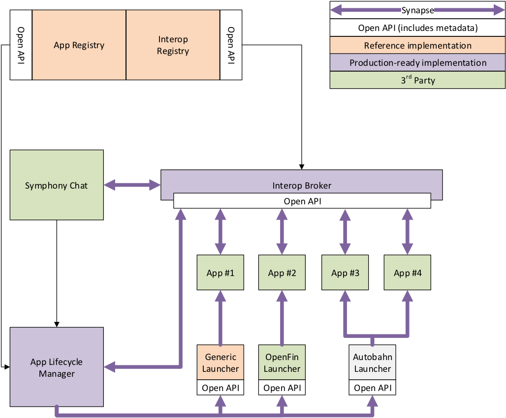
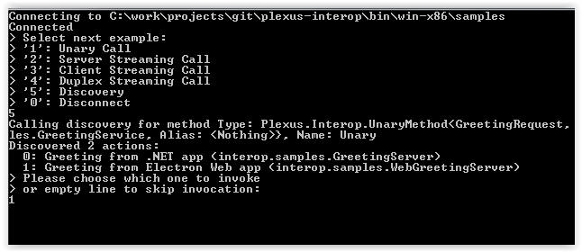
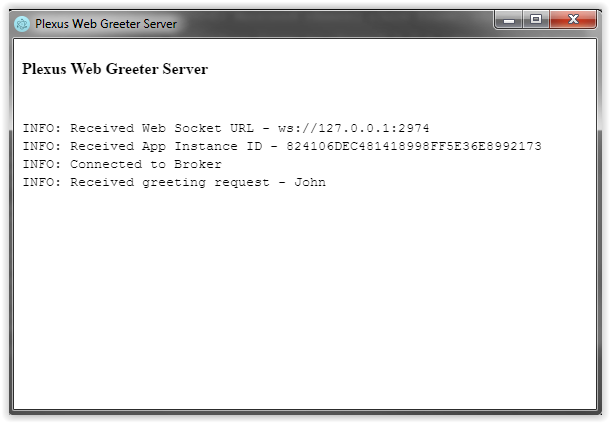
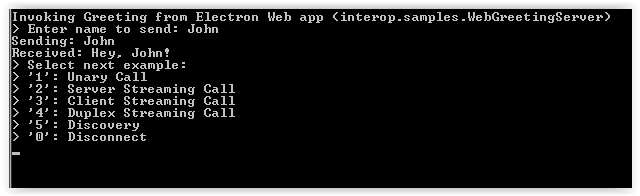

# Plexus Interop

## Overview

**Plexus Interop** is metadata-centric language-agnostic desktop app-to-app interoperability framework with extensible model for launching new instances of desktop Apps on demand.
 
The main goal of the framework is to enable development of extensible workflows connecting independent Apps developed in different technologies (.NET, Web, Java, Python etc) and passing context (structured data objects) between them.

Framework architecture is based around central broker providing hub-and-spoke connectivity between Apps and brokering strongly typed RPC-style calls between them. Broker has a connection to Application Lifecycle Manager which is capable of creating new instances of the Apps based on the their runtime-metadata (e.g. container type, launch command, params etc) defined in a registry.

Plexus Interop separates interoperability from the container, which provides notable advantages: different containers can be leveraged in the same workflow, launched applications residing outside of containers can participate in interop activities.

 
## Repository Overview

Plexus Interop repository consist of the following main sections:
* *desktop* - Interop Broker, .NET Interop Client and sample apps implemented in C# using [.NET Core 2.0](https://www.microsoft.com/net/download/core).
* *web* - Web Interop Client and sample apps implemented in [TypeScript](https://www.typescriptlang.org/).
* *dsl* - [Protobuf](https://developers.google.com/protocol-buffers/) and Plexus Interop grammar parsers, validators and code-generators implemented using [Xtext framework](https://eclipse.org/Xtext/).
* *docs* - documentation implemented in [AsciiDoc](http://asciidoc.org/) format using [Asciidoctor](http://asciidoctor.org/) processor.
* *protocol* - definitions of Plexus Interop protocol messages in [Protobuf](https://developers.google.com/protocol-buffers/) format.
* *samples* - sample interop metadata. 

## Build/Install

All Plexus Interop components can be build using [Gradle](https://gradle.org/) tool using the following single command:

`gradlew build --console plain`

Build produces artifacts into folder "bin".

## Running Samples

After successfull build samples binaries will be located in `bin` directory.

Run .Net to Web interop example on Windows:

- Go to `bin/win-x86/samples`
- Launch Broker – LaunchBroker.cmd
- Launch Greeting Client – LaunchGreetingClient.cmd
    - Choose “Discovery” option (5) and “Greeting from Electron Web app” from discovery response

    
    - Enter name, e.g. “John” and hit enter – Web Greeting Server app will be launched by Broker, print Greeting Request:

    
    - And send response back to .Net Greeting Client

    

    - Then choose Discovery (5) and “Greeting from .Net app” from discovery response
    - Enter another name, e.g. “Mike” and hit enter - .Net Greeting Server app will be launched and print greeting request:

    

## Documentation

To check out docs, visit [https://symphonyoss.github.io/plexus-interop/](https://symphonyoss.github.io/plexus-interop/).

Documentation project is located in folder 'docs'. We build documentation using [AsciiDoc](http://asciidoc.org/).

To render diagrams during the build you need to have [graphviz](http://www.graphviz.org) installed on the machine.

Invoke the following command to run the documentation build:

`gradlew -p docs --console plain`

After successful build documentation is available via:

`bin/docs/html5/index.html`

## Contributing

Please refer to [Contribution guidelines for this project](CONTRIBUTING.md).