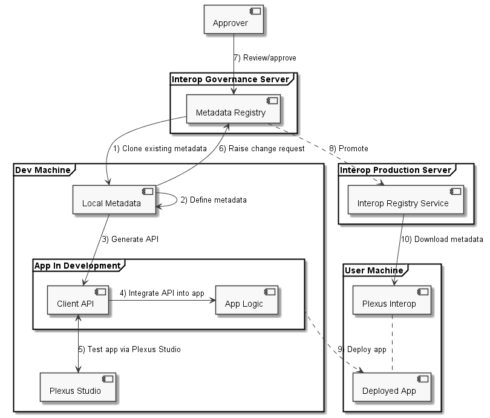

Typical development cycle for integration with Plexus Interop:

[plantuml]
....
@startuml
skinparam monochrome true
skinparam componentStyle uml2

frame "Interop Governance Server" {
    [Metadata Registry]
}

frame "Dev Machine" {
    [Local Metadata]
    [Plexus Studio]
    frame "App In Development" as appDev {
        [Client API]
        [App Logic] as App
    }
}

frame "Interop Production Server" {
    [Interop Registry Service]
}

frame "User Machine" {
    [Plexus Interop]
    [Deployed App]
}

[Metadata Registry] -> [Local Metadata] : 1) Clone existing metadata
[Local Metadata] -> [Local Metadata] : 2) Define metadata
[Local Metadata] -down-> [Client API] : 3) Generate API
[Client API] -> [App] : 4) Integrate API into app
[Client API] <-down-> [Plexus Studio] : 5) Test app via Plexus Studio
[Local Metadata] -up-> [Metadata Registry] : 6) Raise change request
[Approver] -> [Metadata Registry] : 7) Review/approve
[Metadata Registry] ..> [Interop Registry Service] : 8) Promote
appDev ..> [Deployed App] : 9) Deploy app
[Interop Registry Service] -> [Plexus Interop] : 10) Download metadata
[Plexus Interop] .. [Deployed App]
@enduml
....

//Alternative version:
//
//[plantuml]
//....
//@startuml
//skinparam monochrome true
//start
//partition "Dev Machine"
//    :Clone app from\ncentral app registry;
//    repeat
//        :Create/modify interop\nmetadata locally;
//        :Generate client API from local metadata;
//        :Integrate client API into app;
//        :Publish metadata into\nlocal "sandbox" registry;
//        :Test interop flow in "sandbox" mode;
//        if (app provides API?) then (yes)
//            :Call API from Plexus Studio, check app's reaction;
//        else (no)
//        endif
//        if (app consumes API?) then (yes)
//            :Call API from app, check result in Plexus Studio;
//        else (no)
//        endif
//    repeat while (Not happy with result)
//    :Publish new version of the app;
//    :Publish metadata into central\nInterop Registry for approval;
//    if (Metadata OK?) then (yes)
//        :Metadata approved;
//        :Apply changes to central Interop Registry,\n flow available to all users;
//        :Run end-to-end tests with real apps;
//    else (no)
//        :Change rejected, go back to start;
//    endif
//end
//@enduml
//....

. Clone existing interop API definitions (metadata) from remote central registry
. Define new interop metadata locally
. Generate client interop APIs from local metadata
. Integrate generated interop APIs into the app
. Publish new metadata into local "sandbox" registry
. Test interop flow via Plexus Studio:
.. If app provides service then you can call it from Plexus Studio.
.. If app consumes some service then you can check that app sends correct interop messages into Plexus Studio.
.. Repeat steps 2-5 until you are fully happy with API and its implementation.
. Deploy new version of the app with new interop flow
. Publish interop metadata into central registry for approval
. Once new metadata is approved it should get into central Interop Registry and become available to all users
. Test flow between apps end-to-end in real environment

Below we'll explain these steps in more details. Code generation and integration into the app steps are technology-specific, so we provide instructions for two technologies available out of the box: Typescript and .NET

==== Edit interop metadata

Plexus metadata is defined in .plexus and .proto files and can be edited in any Text Editor. Plexus provides Eclipse/Intellij IDEA/VSCode plugins with various IntelliSense features support.

TODO @Mikhail - Add image with auto complete example

TODO @Mikhail - add guidelines on metadata folders structure

===== Validate metadata

You can validate your metadata changes using Plexus SDK:

[source,bash]
----
plexus validate --plexus_path metadata-path --source path/to/File.plexus
----
* *--plexus_path* - specifies a directory in which to look for .proto and .plexus files when resolving import directives. If omitted, the current directory is used.
* *--source* - specifies plexus file to generate metadata for, if omitted, then current directory is scanned for _.proto_ and _.plexus_ files.

TODO @Mikhail - confused by "generate metadata". Copy-paste?

TODO To discuss - are underscores in --plexus_path a standard practice? I do not like underscores :)

===== Publish interop metadata into "sandbox" Interop Registry

For testing purposes it is possible to publish local metadata and launch Plexus sandbox using them.

[source,bash]
----
plexus publish --plexus_path metadata-path --source path/to/File.plexus --out ./metadata.json
----

* *--out* - destination folder for generated JSON definition
* *--plexus_path* - specifies a directory in which to look for .proto and .plexus files when resolving import directives. If omitted, the current directory is used.
* *--source* - specifies plexus file to generate metadata for, if omitted, then current directory is scanned for _.proto_ and _.plexus_ files.

TODO @Mikhail - I do not understand why we need both metadata path and path to .plexus file

===== Publish interop metadata into primary Interop Registry

When updated metadata ready for publish, then Pull Request is raised against main branch using Version Control system.

TODO @Mikhail - aren't we solutionizing here?

===== How to switch between "sandbox" and primary interop registries

TODO @Mikhail - add details

==== Generate client APIs

Plexus provides Code Generation support for multiple programming languages and data formats. All of them use _*.plexus_ and _*.proto_ source files. There is also a way to write custom code generators using Plexus grammar and utility code generation classes.

General code generation command looks as follows:

[source,bash]
----
plexus gen --<language>_out plexus-gen --plexus_path metadata-path --source path/to/File.plexus
----

TODO @Mikhail - I'd use two forms instead of "gen": generate and g

* *--<language>_out* - target folder for required language, possible values for _<language>_ are:
** ts - Typescript
** dotnet - .Net
* *--plexus_path* - specifies a directory in which to look for .proto and .plexus files when resolving import directives. If omitted, the current directory is used.
* *--source* - specifies plexus file to generate metadata for, if omitted, then current directory is scanned for _.proto_ and _.plexus_ files.

TODO - @Mikhail, what "_out" in "ts_out" means? I also vote for a longer, but clearer --typescript version.

==== How to register app as interop service provider

Each application may specify a list of interop components hosted within it using `hostedComponents` property.

TODO @Mikhail - elaborate

==== Interoperability flow in run-time

Here is how typical run-time interoperability flow look like:

* Define handlers for incoming interop API calls (if app provides interop services)
* Connect to Interop Broker
* Call other interop APIs during app life time
* Disconnect from Interop Broker when app closes

IMPORTANT: Handlers for incoming interop API calls should be defined *before* app connects to Interop Broker because Broker may send interop API call right after connect is established.

==== Interop integration into JavaScript app

===== Generate Typescript API (optional)

TypeScript API can be generated using Plexus SDK tool:

[source,bash]
----
 plexus gen --ts_out plexus-gen --plexus_path metadata-path --source path/to/File.plexus
----

===== How to add Plexus JavaScript API into the app

Plexus JavaScript library is packaged as an NPM module. To install it into your app use standard NPM installation process:

[source,bash]
----
npm install --save plexus-js
----

Next reference Plexus API using either standard ES6 _import_ statement...

[source,js]
----
import * as plexus from "plexus-js";
----

... or using Node's _require_

[source,js]
----
const plexus = require("plexus-js");
----

Once you have Plexus API reference you can create entry point for Interop component:

[source,js]
----
include::sample-plexus-interop.js[tag=interop-create]
----

TODO @Mikhail - what ID means here? IMO should be explained.

===== How to handle incoming interop API calls

[source,js]
----
include::sample-plexus-interop.js[tag=point-to-point-handle]
----

TODO @Mikhail - What exactly is "request" argument? Do we always have single object-message or I can define multiple arguments matching API method definition?

===== How connect to Interop Broker

[source,js]
----
include::sample-plexus-interop.js[tag=interop-connect]
----

TODO @Mikhail - what is plexusClient?

===== How to invoke specific app (point-to-point invocation)

To send interop message to specific app:

[source,js]
----
include::sample-plexus-interop.js[tag=point-to-point-call]
----

TODO @Mikhail - I'd show how to get reply message

===== How to do streaming

TODO @Mikhail

==== How to do interop discovery

There is an ability to discover available remote action handlers by various attributes:

[source,js]
----
include::sample-plexus-interop.js[tag=discovery]
----

Where `DiscoveryQuery` and `InteropMetadata` have following structure (using TypeScript syntax):

[source,js]
----
include::sample-plexus-interop.js[tag=discovery-query]
----

TODO @Mikhail - not sure about using TypeScript syntax in this example (InvocationMetadata[]). Also *Ref structures are enigmatic. I'd start with a typical use cases for interoperability before generic description.

===== How to do broadcasts

TODO @Mikhail

==== How to close connection to Interop Broker

[source,js]
----
include::sample-plexus-interop.js[tag=close]
----

==== Interop integration into .NET app

TODO - Anton

===== Generate .NET API

.Net API can be generated using Plexus SDK tool:

[source,bash]
----
 plexus gen --dotnet_out plexus-gen --plexus_path metadata-path --source path/to/File.plexus
----

TODO @Anton, add more info if required

===== How to handle incoming interop API calls

TODO @Anton

===== How connect to Interop Broker

TODO @Anton

===== How to invoke specific app (point-to-point invocation)

TODO @Anton

===== How to do streaming

TODO @Anton

===== How to do interop discovery

TODO @Anton

===== How to do broadcasts

TODO @Anton

===== How to close connection to Interop Broker

TODO @Anton

==== How to debug interop using Plexus Studio

TODO @Mikhail