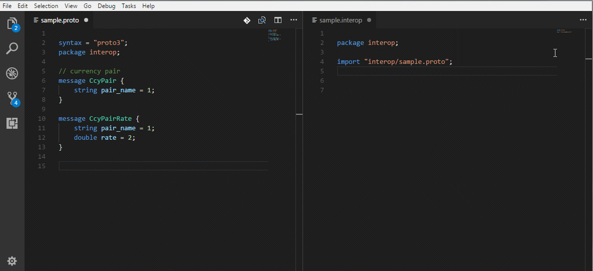

# plexus-interop-vscode

Plexus Interop Language support for Visual Studio Code

## Features

* .interop files syntax highlighting
* .interop files syntax validation
* .proto files syntax highlighting 
* .proto files syntax validation
* Cross references validation and code assistance
* Imports resolution and code assistance

 

## Usage

Open base directory of Plexus Interop Metadata and start editing interop and proto files.