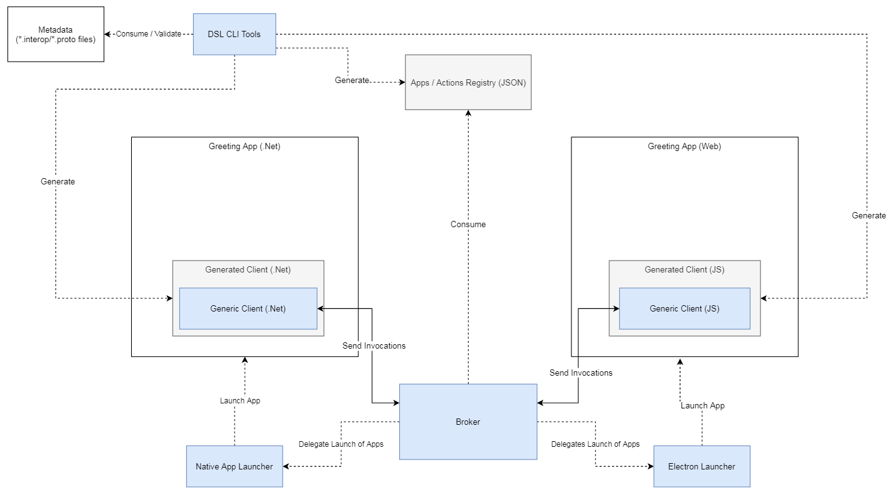

# Greeting Sample Internal Detals

This page provides detailed view on Greeting sample - two apps communicating via Plexus Interop with simple greeting messages. Fully runnable examples are available at **./bin/win-x86/samples/greeting** folder after you run the full build of the repo. Steps to run the demo from your workstation and links to code of demo apps are described at [Public Documentation](https://finos-plexus.github.io/plexus-interop/#sample-apps)

Following diagram defines high level structure of running components, *blue* boxes define Plexus Interop artifacts available for Open Source Community.

- [DSL CLI Tools](./dsl) - Metadata's DSL definition and tooling, including validation / code generation / vscode editor plugin / Command Line Interface and other features
- [Broker](./desktop/src/Plexus.Interop.Broker) - component runningon desktop, the mediator between all communication flows between Applications
- [Generic Client (JS)](./web/packages/client) - JS/TS Client API, entry point of communication between JS based Applications and Broker, used as a base for Generated Clients
- [Generic Client (.Net)](/desktop/src/Plexus.Interop.Client) - .Net Client API, entry point of communication between JS based Applications and Broker, used as a base for Generated Clients
- **Native App Launcher** and [Electron App Launcher](./web/packages/electron-launcher) - reference implementations of **App Launcher** interface, implemented in .Net and JS

