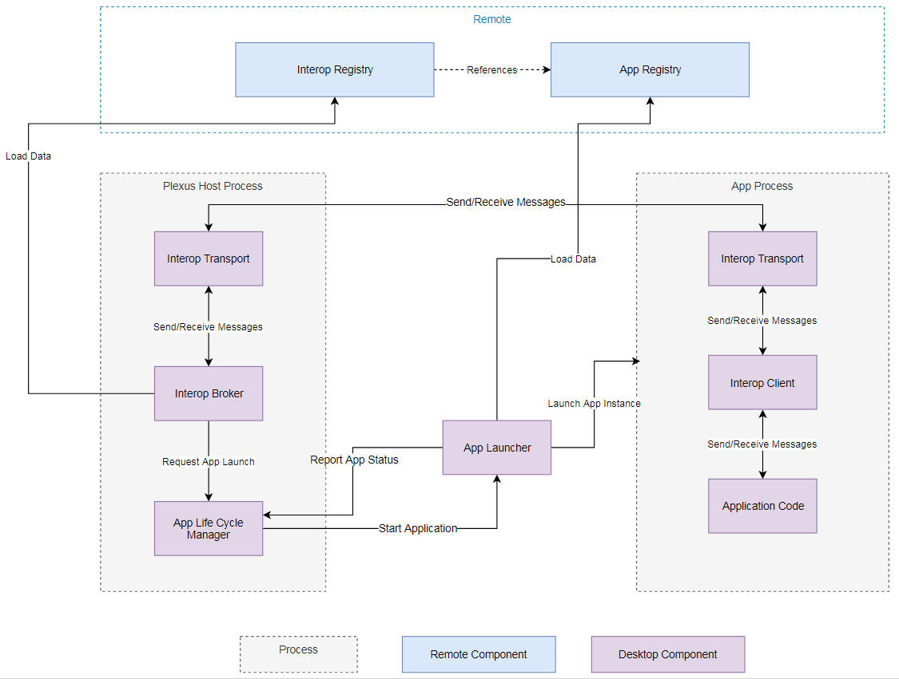

# Node JS Broker Implementation Road Map

<!-- TOC -->
- [High Level Design](#high-level-design)
- [Road Map](#road-map)
    - [1. Adoption of Existing JS Broker for Desktop](#adoption-of-existing-js-broker-for-desktop)
        - [Target State](#target-state)
    - [2. Feature Parity with .Net Broker](#feature-parity-with-net-broker)
        - [Target State](#target-state-3)
    - [3. Support for JSON and ProtobufJS based Serialization for JS clients](#support-for-json-and-protobufjs-based-serialization-for-js-clients)
        - [Target State](#target-state-1)
    - [4. Full Implementation of Common Interop API](#full-implementation-of-common-interop-api)
        - [Target State](#target-state-2)
    <!-- /TOC -->

## High Level Design

Existing [Desktop Interop Broker](./desktop/src/Plexus.Interop.Broker) is implemented using following architecture, including main components:

- **Interop Broker** - process which handles application connections, routes calls between them and able to launch new applications instances on demand.
- **App Life Cycle Manager** - component inside Broker which tracks active connections and can trigger launch of an application on demand by sending a request to the appropriate Application Launcher.
- **App Launcher** - responsible for launching of Applications and reporting about their status to App Life Cycle Manager.
- **Interop Transport** - plagguble transport implementation, used by both Broker and App Instance for comminication

Current [Broker Implementation for Stand alone Browser](./web/packages/broker/src/api/) based on same principles, therefore already defined required interfaces:

- [App Life Cycle Manager (TS)](./web/packages/broker/src/lifecycle/AppLifeCycleManager.ts)
- [App Launcher (TS)](./web/packages/broker/src/launcher/AppLifeCycleManager.ts)
- [Transport Connection (TS)](./packages/transport-common/src/transport/TransportConnection.ts)
- [Interop Client (TS)](./packages/client/src/client/api/generic/GenericClientApi.ts)

Also default implementation of some components, like **InteropRegistryProvider**/**Broker**/**Discovery Handler**/etc, will work well in Node JS environment. So we can start with adopting everything we already have and implement missed Desktop implementations like native App Life Cycle Manager.

## Road Map

### 1. Adoption of Existing JS Broker for Desktop

As described above - we need to adopt existing functionality of **JS Broker for Stand Alone Browser** to Desktop environment. 

#### Target State

Node JS Broker, which supports Web Sockets Transport for connectivity, basic Discovery, fully compatible with both Generic and Generated Typescript/.Net clients.

### 2. Feature Parity with .Net Broker

Implement all functionality, already available in .Net Broker implementation

#### Target State

Supports all existing functionality and Transport Implementation, including:

- Different Launch Modes
- Named Pipes Transport for .Net
- Full Discovery Support
- etc

### 3. Support for JSON and ProtobufJS based Serialization for JS clients

We still need to support ProtobufJS based transport for **.Net** <-> **JS** communication and for support of existing clients. However we would like to add JSON based serialization for JS clients to significantly decrease Generated JS bundle size and unblock usage of Generic API (no code generation).

#### Target State

Plexus Client can choose one of two serialization mechanisms during connection to Broker.

### 4. Full Implementation of Common Interop API

Support of all supported methods of [Common Interop API](https://github.com/finos-plexus/finos-plexus.github.io/blob/master/client-api/client-api.ts)

#### Target State

Applications implemented with [Common Interop API](https://github.com/finos-plexus/finos-plexus.github.io/blob/master/client-api/client-api.ts) can use **Plexus Interop** as *InteropPlatform*.